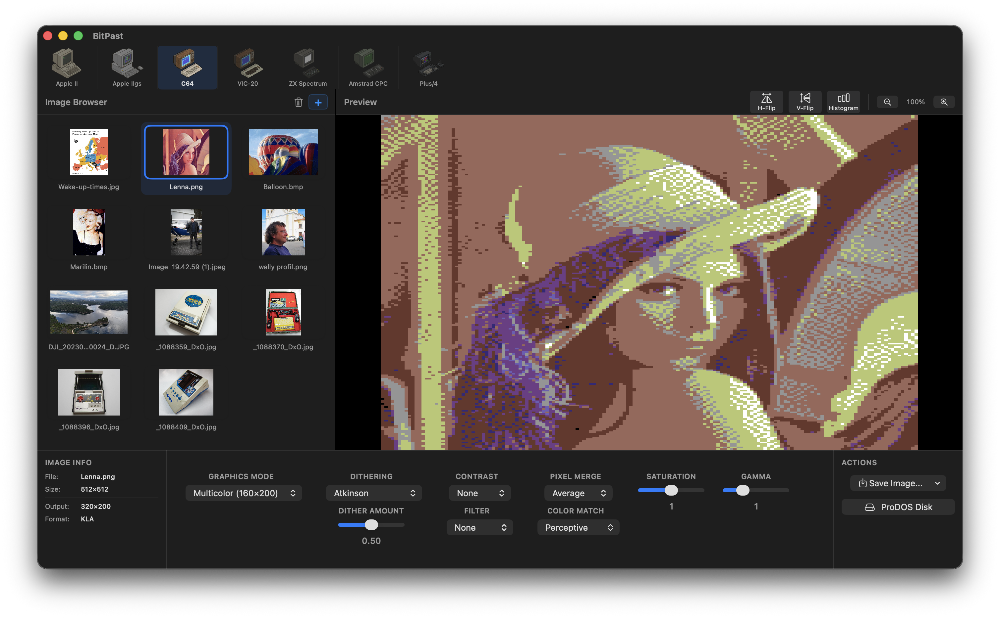

# BitPast - Retro Graphics Converter


**BitPast** is a modern, native macOS application for converting images into authentic retro computer graphic formats including **Apple II**, **Apple IIgs**, **Commodore 64**, **VIC-20**, **ZX Spectrum**, **Amstrad CPC**, and **Plus/4**.




## ✨ Features

### 🖥️ Modern macOS Interface
- **Drag & Drop:** Drag multiple images directly from Finder or the web.
- **Batch Processing:** Load dozens of images into a grid browser and process them one by one.
- **Live Preview:** See changes instantly as you adjust sliders for dithering, contrast, and color matching.
- **Zoom & Pan:** Inspect every single pixel with a high-performance zoomable preview.

### 🎨 Supported Systems

#### 🍏 Apple II (8-Bit)
Powered by `b2d`, supporting the full range of classic graphics modes:
- **DHGR** (Double Hi-Res): 140x192 (16 colors) or 560x192 (Monochrome).
- **HGR** (Hi-Res): 280x192 (6 colors).
- **LGR / DLGR**: Lo-Res and Double Lo-Res block graphics.
- **Output:** `.BIN` files ready for hardware.

#### 🌈 Apple IIgs (16-Bit)
Powered by a **native Swift engine** featuring advanced color quantization:
- **3200 Mode (Brooks Format):** Up to 3200 unique colors using per-scanline palettes.
- **256 Colors (16 Palettes):** Standard SHR format with intelligent palette grouping.
- **320x200 (16 Colors):** Classic Super Hi-Res with single palette.
- **640x200 Modes:** 4-color, Enhanced, and Desktop variants.
- **Output:** `.SHR` and `.3200` files.

#### 💾 Commodore 64
Full VIC-II graphics support:
- **HiRes Mode:** 320×200, 2 colors per 8×8 character cell.
- **Multicolor Mode:** 160×200, 4 colors per 4×8 character cell.
- **16-color VICE/Pepto palette.**
- **Output:** `.art` (Art Studio) and `.kla` (Koala Painter) formats.

#### 📺 VIC-20
Character-based graphics with full color support:
- **HiRes Mode:** 176×184, 2 colors per 8×8 character cell.
- **LowRes Mode:** 88×184, 4 colors per 4×8 cell (double-wide pixels).
- **16-color VIC-20 palette.**
- **Output:** `.prg` (self-displaying executable).

#### 🔲 ZX Spectrum
Attribute-based graphics with authentic color clash:
- **256×192 resolution** with 8×8 attribute cells.
- **2 colors per cell** (ink + paper) from 15-color palette.
- **8 colors × 2 brightness levels.**
- **Output:** `.scr` (6912 bytes: bitmap + attributes).

#### 🖥️ Amstrad CPC
Hardware palette graphics:
- **Mode 1:** 320×200, 4 colors from 27-color palette.
- **Mode 0:** 160×200, 16 colors from 27-color palette.
- **27-color hardware palette** (3 levels R/G/B).
- **Output:** `.scr` with AMSDOS header.

#### 🎮 Commodore Plus/4
TED chip graphics with extended palette:
- **HiRes Mode:** 320×200, 2 colors per 8×8 character cell.
- **Multicolor Mode:** 160×200, 4 colors per 4×8 cell.
- **128-color TED palette** (16 hues × 8 luminance levels).
- **Output:** `.prg` (10,000 bytes: nibble + screen + bitmap).

### 🎛️ Fine-Tuning Control

**Processing Options:**
- **Dithering Algorithms:** None, Floyd-Steinberg, Atkinson, Noise, Bayer (2×2 to 16×16), Blue Noise.
- **Contrast Enhancement:** None, HE, CLAHE, SWAHE (adaptive histogram equalization).
- **Color Matching:** Euclidean, Perceptive, Luma, Chroma, Mahalanobis.
- **Filters:** Lowpass, Sharpen, Emboss, Edge detection.
- **Saturation & Gamma:** Fine-tune color intensity and brightness.

**Preprocessing Filters:**
- **Median:** Noise reduction with selectable kernel size (3×3, 5×5, 7×7).
- **Sharpen:** Edge enhancement with adjustable strength (0.2–2.5).
- **Sigma:** Edge-preserving blur for smoothing gradients (5–50 range).
- **Solarize:** Artistic partial negative effect (32–224 threshold).
- **Emboss:** 3D relief effect with depth control (0.3–2.0).
- **Find Edges:** Sobel edge detection for line-art output (10–100 sensitivity).

### 💾 Export Formats
- **Modern Previews:** Export as PNG, JPG, GIF, or TIFF for web use.
- **Native Formats:** Each system exports its authentic file format.
- **ProDOS Disk Images:** Create bootable `.PO`, `.2MG`, or `.HDV` disk images (Apple II/IIgs).

## 🚀 How to Use

1. **Drag Images** into the left "Image Browser" panel.
2. Select an image to preview it.
3. Choose your **System** from the horizontal bar at the top (Apple II, Apple IIgs, C64, VIC-20, ZX Spectrum, Amstrad CPC, Plus/4).
4. Select the **Mode** and tweak **Dither**, **Contrast**, and other settings.
5. Click **Export** in the bottom right corner.
   - Choose **PNG/JPG** for a visual preview.
   - Choose **Native Format** to save the raw file for the target system.
   - Choose **Create ProDOS Disk** to package Apple II/IIgs files onto a disk image.

## 🛠️ Technical Details

BitPast is built with **Swift** and **SwiftUI** for macOS.

- **Frontend:** SwiftUI (Grid Views, HSplitView, Combine for debounced live previews).
- **Backend (Apple II):** `b2d` (modified build with struct packing fixes for modern macOS ARM64/x86_64).
- **Backend (All Others):** Native Swift implementations with authentic format output.
- **Disk Operations:** Native Swift implementation for ProDOS volume creation and file management.

## 📦 Installation

### From Source
1. Clone the repository.
2. Open `BitPast.xcodeproj` in Xcode.
3. Build and Run (Requires macOS 12.0+).

### From Binary Release

Since this app is not distributed through the official Apple App Store and may not have been notarized by a paid Apple Developer Account, macOS might display a security warning upon the first launch.

You may see a message stating: "The app cannot be opened because it is from an unverified developer."

How to bypass this warning (one-time process):

1. Close the warning window.
2. Go to the app in Finder (e.g., in your Applications Folder).
3. Hold the Control key and click on the app icon (or use the Right-Click menu).
4. Select Open from the context menu.
5. In the subsequent dialog box, confirm that you want to open the app by clicking Open again.
6. The application will now launch and will be trusted by macOS for all future starts.

If this does not work then:
1. Open Terminal (Applications → Utilities → Terminal)
2. Run the following command (if installed in Applications):<br>
```xattr -cr /Applications/BitPast.app```


## 👏 Credits

- **Bill Buckels**: For creating the original **b2d** (Bmp2DHR) command-line tool. [Visit AppleOldies.ca](https://www.appleoldies.ca/bmp2dhr/).
- **Maciej Małecki (mmalecki)**: For the **retropic** Java reference implementation used for C64, VIC-20, ZX Spectrum, Amstrad CPC, and Plus/4 converters.


## 📄 License

This project is open source. The UI code is provided under the MIT License.


[](https://github.com/portwally/BitPast/releases)
[](https://github.com/portwally/BitPast/stargazers)
[](https://github.com/portwally/BitPast/network/members)


